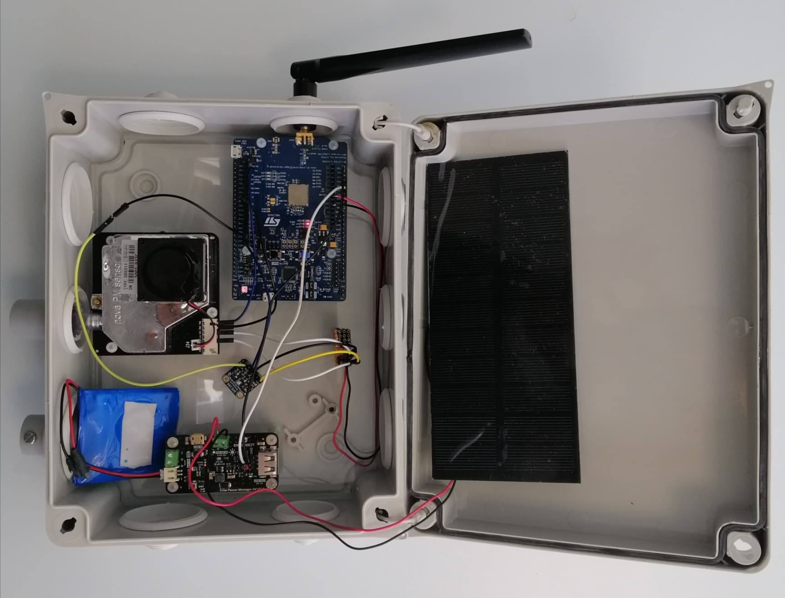
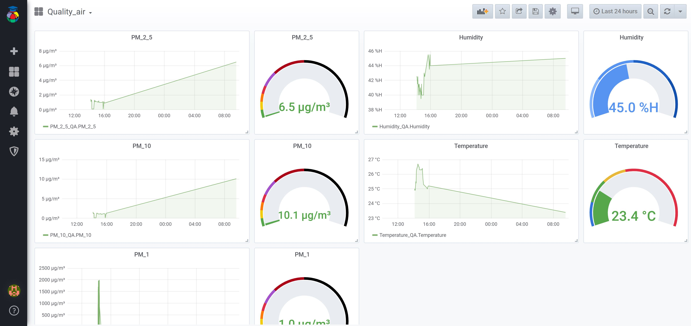
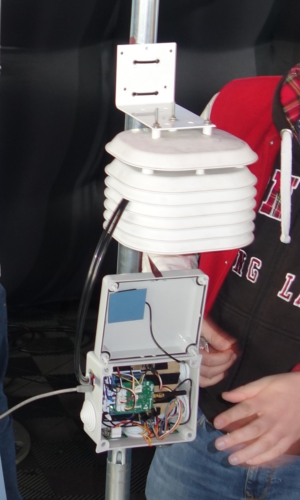
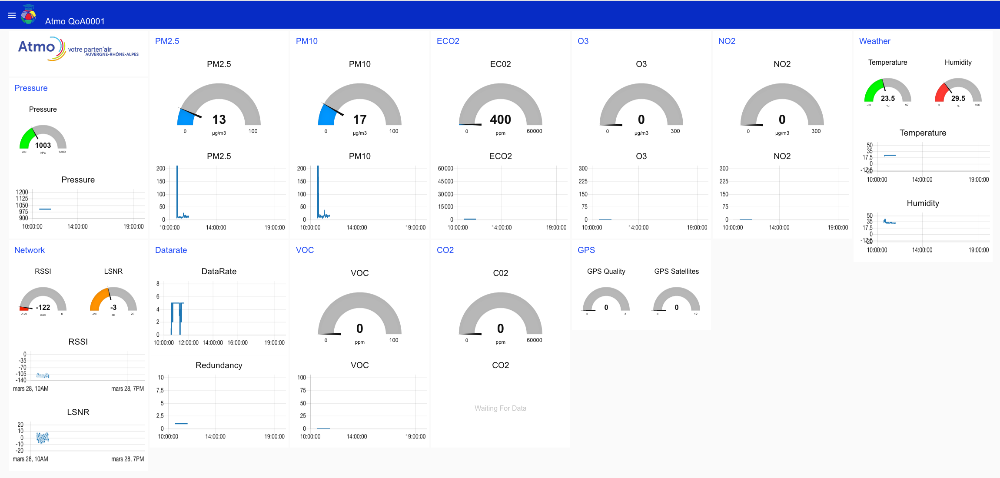

# Air Quality Station

Credit: [@villeofficiel](https://twitter.com/villeofficiel/status/1462069831444967427)

This project proposes the hardware design and the firmware of various low-cost and repairable airquality stations for citizens.
Air quality measurements are transmitted over a private or public LoRaWAN network ([Helium](https://explorer.helium.com/), [TTN](https://www.thethingsnetwork.org/) or self-hosted Chirpstack) and displayed as open data ([luftdaten](https://luftdaten.info/), [opensensemap](https://opensensemap.org/)) or in private dashboard ([cayenne](https://accounts.mydevices.com), [thingsboard.io](https://thingsboard.io/)).
The firmware is based on [RIOT OS](https://riot-os.org/).
The IAQ sensors are listed [here](./sensors.md)

[Github repositories](https://github.com/airqualitystation)

## Version 2024 (WIP)

### ESP32 DevKit with BME280 and Sensirion SPS30
* Board: ESP32 DevKit on [TinyGS_2G4](https://github.com/thingsat/tinygs_2g4station)
* Sensors:
  * [MIKROE-1978 (BME280)](https://www.mikroe.com/weather-click) on Mikrobus Slot 1: Temperature, Humidity, Pressure
  * [Sensirion SPS30 PM Sensor](https://sensirion.com/products/catalog/SPS30/) on Grove I2C connector: PM 1, 2.5, 10
* Connectivity: Wifi, BLE, LoRaWAN (Mikrobus RN2483 on Mikrobus Slot 0)
* Firmware : [RIOT OS](https://doc.riot-os.org/group__boards__esp32__wroom-32.html)

## Version 2022

### LoRa E5 Mini with BME280 and PMS7003
* Board: LoRa E5 Mini
* Sensors:
  * BME280: Temperature, Humidity, Pressure
  * PMS7003: PM 1, 2.5, 10
* [Firmware : RIOT OS](https://github.com/airqualitystation/firmware_for_bmx280_pms7003)
* [Decoder](https://github.com/airqualitystation/firmware_for_bmx280_pms7003/blob/main/codec/decoder.js)
* [Poster](presentations/poster_uspn_mlaix.pdf)

### Wio Terminal
* MCU: [Seeedstudio](https://wiki.seeedstudio.com/LoRa_E5_Dev_Board/)), [Wio Terminal](https://github.com/CampusIoT/tutorial/tree/master/wioterminal)
* Sensors:
  * Temperature, Humidity, Pressure
  * [CCS811](https://github.com/airqualitystation/firmware/blob/master/ccs811.md) air quality sensor.
  * [Grove CO2 SGP30](https://wiki.seeedstudio.com/Grove-VOC_and_eCO2_Gas_Sensor-SGP30/) .
  * [Grove CO2 SDC41](https://wiki.seeedstudio.com/Grove-CO2-Temperature-Humidity-Sensor-SCD41/) 
  * [Grove - Gas Sensor V2(Multichannel)](https://wiki.seeedstudio.com/Grove-Multichannel-Gas-Sensor-V2/) for detecting CO, NO2, C2H5CH, VOC  with [GM-102B, GM-302B, GM-502B and GM-702B sensors](https://www.cnwinsen.com/products/MEMS-sensor)
  * [Geiger counter with UART](https://www.sparkfun.com/products/retired/10742)
  * Others to defined
* Firmware : Arduino or RIOT OS

## Version 2021
* MCU: STM32WL55 ([Nucleo](https://www.st.com/en/evaluation-tools/nucleo-wl55jc.html), [Seeedstudio](https://wiki.seeedstudio.com/LoRa_E5_Dev_Board/))
* Sensor: [CCS811](https://github.com/airqualitystation/firmware/blob/master/ccs811.md) air quality sensor.
* Firmware : C on RIOT OS

## Version 2020

* MCU: [STM32 Nucleo B-L072Z-LRWAN1](https://www.st.com/en/evaluation-tools/b-l072z-lrwan1.html).
* Firmware : C on RIOT OS

Youtube: https://www.youtube.com/playlist?list=PLF3XltIz6OpR8-TI78mwKeDekHcQkxyBV

## Version 2019

* MCU: [P-NUCLEO-LRWAN1](https://www.st.com/en/evaluation-tools/p-nucleo-lrwan1.html).
* Firmware : MBed

## Partners
* [Polytech Grenoble, Université Grenoble Alpes](https://www.polytech-grenoble.fr/)
* [Phelma, Grenoble INP](https://phelma.grenoble-inp.fr/)
* [ATMO Auvergne-Rhône-Alpes](https://www.atmo-auvergnerhonealpes.fr/)
