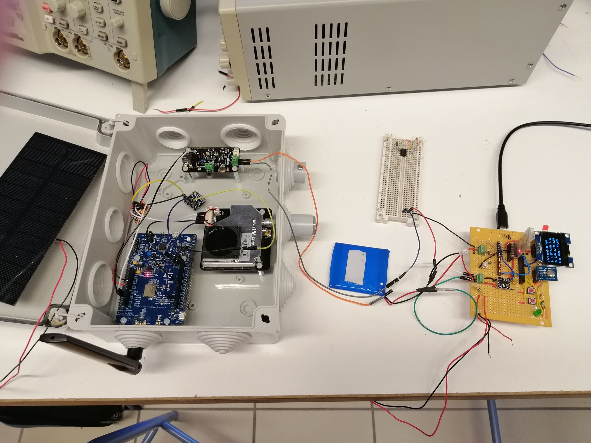

# Air Quality Station

This project proposes the hardware design and the firmware of a low-cost air quality station. Air quality measurements are transmitted over a LoRaWAN network (TTN or Chirpstack).

